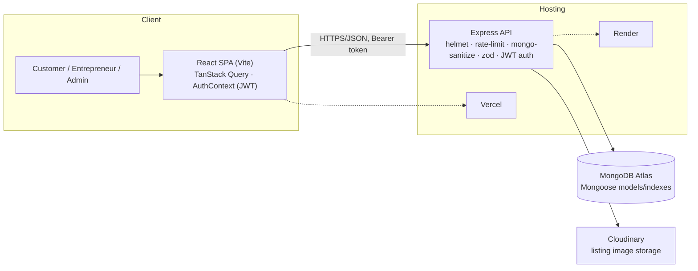

# HunarHub

[](https://github.com/hiteshkumarTech/HunarHub/actions/workflows/ci.yml)

A full-stack digital marketplace connecting local Indian micro-entrepreneurs — cobblers, potters (kumhar),
tailors, artisans, and small vendors — directly with customers.

## Live demo

- **Frontend**: [hunarhub-eight.vercel.app](https://hunarhub-eight.vercel.app)
- **API**: [hunarhub-api-s03k.onrender.com/health](https://hunarhub-api-s03k.onrender.com/health) — free-tier
  cold start, ~30s on the first request after ~15 min idle; fast on every request after that.

Registration, login, role authorization, orders, listings, marketplace filters, and the admin dashboard have
all been tested end-to-end against these exact live URLs — not just deployed and assumed to work (see
[Deployment](#deployment)).

## Problem

Local skilled workers and small sellers — cobblers, potters, tailors, artisans, home-based vendors — largely
depend on foot traffic and word of mouth. They have no simple, low-friction way to be found online, show what
they make, take requests, and build a reputation. Customers, in turn, have no single place to discover and
hire verified local talent or buy their goods directly. HunarHub is a lightweight, web-based answer to both
sides of that gap — discovery + trust + direct transaction, without needing either side to be technical.

## Key features by role

**Customer** — register/login, browse entrepreneurs by category/location/price, a dedicated product/service
**marketplace** for discovering listings directly, entrepreneur profiles with a photo gallery, request a
service or buy a product, track order status, leave a review after completion, save favourites, report an
issue on an order.

**Entrepreneur** — dashboard with KPIs (earnings, completed/active/pending orders, rating), manage services
and products (with Cloudinary photo uploads), accept/decline/complete requests, toggle availability, view
incoming orders, report an issue.

**Admin** — verify entrepreneurs, manage the craft category list, monitor every order/request platform-wide
(read-only), review and resolve complaints/disputes, real platform analytics (users, listings, orders, open
complaints — no fabricated numbers).

## Screenshots

Not embedded in this repo (no browser-automation tool was used to capture them). See
**[SUBMISSION-CHECKLIST.md](./SUBMISSION-CHECKLIST.md)** for the exact list of screens to capture manually
before submission.

## Tech stack

**Frontend** — React 19 · Vite 6 · TypeScript (strict) · Tailwind CSS 4 · TanStack Query 5 · React Router 7 ·
Motion (Framer Motion) · lucide-react · Vitest + Testing Library.

**Backend** (`/server`) — Express 4 · MongoDB + Mongoose 8 · JWT auth · Zod validation · Helmet · rate limiting
· mongo-sanitize · Cloudinary (image uploads, via Multer) · TypeScript, run via `tsx`.

**Hosting** — Vercel (frontend) · Render (API) · MongoDB Atlas (database).

## Architecture overview



- **Auth** — JWT (`Authorization: Bearer <token>`), stored client-side, session restored via `GET /api/auth/me`;
  routes guarded by role (`RequireAuth`).
- **Data fetching** — every screen goes through a typed hook (`src/hooks/*`) on TanStack Query; one fetch
  wrapper (`src/lib/api.ts`) injects the token and normalises errors.
- **Orders / earned reviews** — a request/order starts `pending`; the entrepreneur accepts/declines/completes
  it. A review is only accepted server-side if the caller has a `completed` order with that entrepreneur.

Full depth (API structure, models, request flow, design decisions, trade-offs) is in
**[TECHNICAL-DESIGN.md](./TECHNICAL-DESIGN.md)**. Visual design tokens/components: **[DESIGN-SYSTEM.md](./DESIGN-SYSTEM.md)**.

## Main user flow

1. A customer registers, browses the **Marketplace** (or Browse Talent to find a seller first), filters by
   category/location/price, and opens a listing or profile.
2. They request a service or buy a product → the order appears as `pending` for the entrepreneur.
3. The entrepreneur sees it on their **Dashboard**, accepts it, does the work, marks it `completed`.
4. The customer sees the status update on `/orders`, leaves a review (or reports an issue if something went
   wrong).
5. An admin can verify the entrepreneur, monitor the order, manage categories, and resolve any complaint —
   all from `/admin`.

## Local setup

```bash
# Frontend
npm install
npm run dev            # http://localhost:5173

# Backend (separate terminal)
cd server
npm install
cp .env.example .env   # fill in MONGODB_URI at minimum
npm run dev            # http://localhost:4000
```

The frontend's API base URL defaults to the deployed Render backend (see `src/lib/api.ts`), so `npm run dev` in
`/` alone is enough to click around against live data. To point it at your local API instead, copy `.env.example`
to `.env` and set `VITE_API_URL=http://localhost:4000`.

Other scripts: `npm run build` (typecheck + production build), `npm run preview` (serve the build),
`npm run typecheck`, `npm test` / `npm run test:watch`. Backend: `npm run seed` (populate demo data),
`npm run typecheck`.

### Demo accounts

Password for both: `password123`. Deliberately public — try them on the live site, they can't reach another
user's data or any admin functionality.

| Role | Email | Try |
|---|---|---|
| Customer | `priya@example.com` | Marketplace/Browse → open a profile or listing → request a service → `/orders` to track it, leave a review or report an issue once it's completed |
| Entrepreneur | `ramesh@hunarhub.in` | `/dashboard` → accept/decline requests → mark complete → toggle availability → manage listings → check earnings |

**Admin**: intentionally not publicly shared — see [DEPLOY-CHECKLIST.md](./DEPLOY-CHECKLIST.md) for why (a
past credential-exposure incident) and how admin access is provisioned instead.

### Environment variables

Full reference (every variable, what it's for, required in dev vs. prod, client-safe or not) is in
[DEPLOY-CHECKLIST.md § 4](./DEPLOY-CHECKLIST.md#4-environment-variables--full-reference). Copy
`.env.example` → `.env` (frontend) and `server/.env.example` → `server/.env` (backend) to start; only
`MONGODB_URI` is required to run the backend locally.

## Testing

```bash
npm test               # frontend — Vitest + Testing Library
cd server && npm test  # backend — Vitest + Supertest + mongodb-memory-server (in-memory, never a real DB)
```

**Frontend — 30 tests.** Fetch client + error normalisation, marketing-page smoke test, ARIA/keyboard nav on
Tabs, image-upload validation/preview, marketplace query-param building + pagination, complaint form
validation/submission, admin complaints panel, Dashboard earnings correctness against a mixed-status order set.

**Backend — 85 tests** (`server/src/routes/*.test.ts`, plus the startup bootstrap). Auth, role authorization,
listing ownership (verified against DB state, not just status codes), the order lifecycle and cross-seller
isolation, the earned-review rule, admin routes (real counts, moderation, filters), image uploads (ownership,
MIME/size validation, gallery cap, cleanup — Cloudinary fully mocked), marketplace filters, complaint ownership
and admin management. Each suite boots its own in-memory MongoDB instance — nothing here ever touches a real
database, local or production.

**CI** (`.github/workflows/ci.yml`) runs both suites, typecheck, and the production build on every PR and every
push to `main`. No secrets required.

## Deployment

See **[DEPLOY-CHECKLIST.md](./DEPLOY-CHECKLIST.md)** for the full step-by-step. Short version: frontend →
Vercel (`vercel.json` has the SPA rewrite), backend → Render via `server/render.yaml` (Blueprint), database →
MongoDB Atlas.

## Requirement coverage

Every requirement from the internship brief, classified **DONE** / **INTENTIONALLY SIMPLIFIED** / **OUT OF
SCOPE**. Full detail + implementation pointers: [ROADMAP.md § Requirement traceability matrix](./ROADMAP.md#requirement-traceability-matrix-m10).

**Customer**

| Requirement | Status |
|---|---|
| Registration / login | DONE |
| Browse entrepreneurs by category | DONE |
| Search by skill | DONE |
| Location filtering | DONE |
| Price filtering | DONE |
| Entrepreneur profiles, skills/experience | DONE |
| Product gallery | DONE |
| Pricing | DONE |
| Service requests | DONE |
| Product purchases / orders | DONE |
| Order/request history | DONE |
| Ratings / feedback | DONE |

**Entrepreneur**

| Requirement | Status |
|---|---|
| Dashboard | DONE |
| Profile management | DONE |
| Skill/service listings | DONE |
| Product listings with images | DONE |
| Accept/reject requests | DONE |
| Availability | DONE |
| Orders/service requests | DONE |
| Earnings overview | DONE |

**Admin**

| Requirement | Status |
|---|---|
| Entrepreneur verification | DONE |
| Category/skill management | INTENTIONALLY SIMPLIFIED — fixed 5-category set, label/active management only, no dynamic add (avoids a control that couldn't actually work end-to-end; see ROADMAP.md) |
| Order/request monitoring | DONE |
| Complaints/disputes | DONE |
| Analytics/reports | DONE |

**Non-functional**

| Requirement | Status |
|---|---|
| Responsive UI | DONE |
| Authentication/security | DONE |
| Reliable order tracking | DONE |
| Deployment-ready | DONE |
| Payments, logistics, native mobile, AI | OUT OF SCOPE — explicitly deferred to Future Enhancements by the brief itself |

## Known limitations

- **Render free-tier cold start** — ~30s on the first request after ~15 min idle.
- **Location filtering is exact city/state text match**, not geospatial/"near me" — matches the brief's own
  "no GPS/Maps/geocoding" scope note.
- **Fixed 5-category taxonomy** — admin can rename/deactivate, not add a 6th (see Requirement coverage above).
- **No payment gateway, logistics, or native mobile app** — explicitly out of scope per the internship brief
  (see Future enhancements below).
- **Admin account isn't publicly documented** — a deliberate security decision after a past credential-exposure
  incident (see DEPLOY-CHECKLIST.md), not an oversight.
- **No account/order/complaint deletion endpoint anywhere** — accounts and records created are permanent;
  affects testing hygiene more than end users.

Full, longer-running backlog (payments, messaging, observability, i18n, etc.) is tracked in
[ROADMAP.md](./ROADMAP.md).

## Future enhancements

Per the internship brief's own scope boundary — explicitly *not* part of this submission:

- Digital payments/wallet (e.g. Razorpay) with hold/escrow on completion
- Logistics/delivery tracking, international shipping
- Native mobile app
- AI-driven recommendations
- A richer, fully dynamic category/skill taxonomy
- Notifications (email/in-app) and customer↔entrepreneur messaging

## Submission

Project description, demo script, and the submission checklist live in:
- **[PRD.md](./PRD.md)** — product requirements document
- **[TECHNICAL-DESIGN.md](./TECHNICAL-DESIGN.md)** — architecture, API, data model, trade-offs
- **[DEMO-SCRIPT.md](./DEMO-SCRIPT.md)** — a 2–3 minute walkthrough script
- **[SUBMISSION-CHECKLIST.md](./SUBMISSION-CHECKLIST.md)** — submission checklist, screenshot list, project
  description, resume bullets
- **[ROADMAP.md](./ROADMAP.md)** — full milestone history, requirement traceability matrix, remaining backlog
