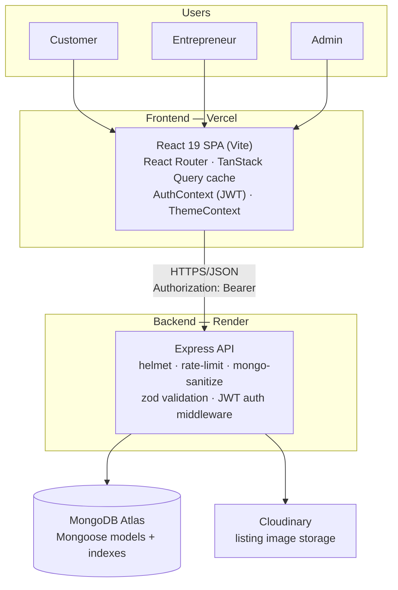
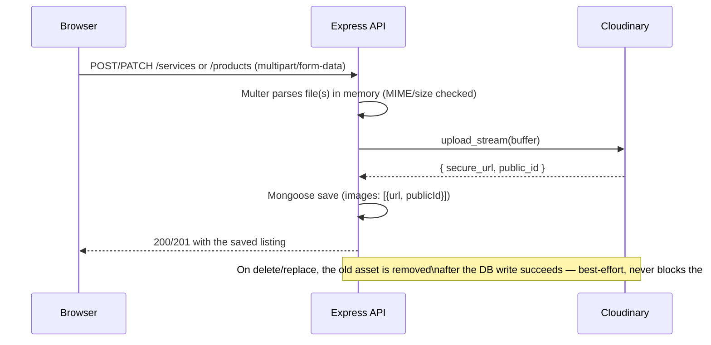

# HunarHub — Technical Design

Architecture, API surface, data model, and the trade-offs behind them. For product scope see
[PRD.md](./PRD.md); for the 2-minute overview see [README.md](./README.md).

## 1. System architecture



One repo, two deployables: the frontend (repo root) and the API (`/server`), each with its own `package.json`,
build, and test suite. They communicate only over HTTPS/JSON — no shared runtime, no monorepo tooling beyond
that.

## 2. Frontend architecture

```
src/
├─ main.tsx                 # app entry — providers (Theme, Query, Auth, Toast) + BrowserRouter
├─ App.tsx                  # routes; everything but Landing/Browse is code-split (React.lazy)
├─ index.css                # Tailwind 4 theme — fonts, color tokens, dark-mode variables, focus-visible
├─ types.ts, types/api.ts   # shared TypeScript types — hand-kept in sync with the API's serializers
├─ lib/                     # api.ts (fetch client), queryClient.ts, utils.ts, recentlyViewed.ts
├─ hooks/                   # one module per resource: entrepreneurs, orders, favorites, reviews,
│                           # listings, admin, marketplace, categories, complaints
├─ context/                 # AuthContext (session/JWT), ThemeContext (dark mode)
├─ data/mockData.ts         # landing-page fallback only — CATEGORIES here is a marketing constant;
│                           # Register/Browse/Marketplace read the live category list from the API instead
├─ components/
│  ├─ ui/                   # Button, Card, Badge, Avatar, Tabs, StatusBadge, Toast, States, Field, Kpi,
│  │                        # ConfirmAction, ImageUploadField, ThemeToggle — see DESIGN-SYSTEM.md
│  ├─ landing/               # HeroSection, FeaturedEntrepreneurs, TrendingProducts, Testimonials, …
│  ├─ admin/                 # AdminOverview, AdminUsersPanel, AdminListingsPanel, AdminOrdersPanel,
│  │                        # AdminComplaintsPanel, AdminCategoriesPanel
│  ├─ dashboard/             # ListingsManager — entrepreneur's own create/edit/delete UI
│  ├─ auth/AuthShell.tsx     # shared Login/Register shell
│  ├─ MarketplaceListingCard.tsx  # a single service/product card with its seller attached
│  └─ ComplaintForm.tsx      # inline "report an issue" form, shared by MyOrders + Dashboard
└─ pages/                   # Landing, Browse, Marketplace, Profile, Dashboard, Login, Register,
                             # Favourites, MyOrders, AdminDashboard
```

**Data fetching** — every screen goes through a typed hook in `src/hooks/*` built on TanStack Query.
`src/lib/api.ts` is the single fetch wrapper: injects the bearer token from `tokenStore` (a thin
`localStorage` accessor), normalises non-2xx responses into a typed `ApiError { status, message, details }`,
and handles `FormData` bodies (image uploads) without JSON-stringifying them. Mutations invalidate the
relevant query keys so the UI reflects server state without manual refetch plumbing.

**Auth** — `AuthContext` holds the current user and exposes `login/register/logout`. On first load it tries to
restore a session from a stored token via `GET /api/auth/me`. `RequireAuth` wraps role-gated routes
(`/dashboard` → entrepreneur, `/orders`/`/favourites` → customer, `/admin` → admin) and redirects otherwise —
this is a UX convenience, not the real security boundary (see § 4).

**Routing** — `Landing` and `Browse` load eagerly (highest-traffic entry points); everything else is
`React.lazy`-split so its JS only downloads when a visitor actually navigates there.

## 3. Backend architecture

```
server/src/
├─ app.ts, index.ts         # Express app wiring; index.ts is the real entry point (connects DB, boots
│                           # the categories bootstrap, starts listening) — app.ts alone is what the test
│                           # suite imports, so tests never touch a real database or run the bootstrap
├─ config/                  # db.ts (Mongoose connect), env.ts (fail-fast env validation), cloudinary.ts
├─ middleware/               # auth (JWT verify), rateLimit, sanitize (mongo-sanitize), validate (Zod),
│                           # upload (Multer), error (central error handler)
├─ models/                  # User (embeds entrepreneur profile), Order, Review, Service, Product,
│                           # Favorite, Category, Complaint
├─ routes/                  # auth, entrepreneurs, services, products, listings, categories, orders,
│                           # reviews, favorites, complaints, admin
├─ utils/                   # ApiError, asyncHandler, serialize (Mongoose doc → API JSON), token,
│                           # imageGallery (upload/gallery-diff helpers)
├─ startup/ensureCategories.ts  # idempotent default-category upsert, runs once on every server boot
├─ test/                    # db.ts (in-memory MongoDB harness), fixtures.ts (seed users + tokens)
├─ seed/seed.ts             # standalone script — demo accounts, entrepreneurs, listings, orders,
│                           # categories, one demo complaint
└─ scripts/setAdminPassword.ts  # rotate the admin password on an already-seeded DB without wiping it
```

**Request lifecycle**: `helmet` (security headers) → CORS allowlist → rate limiter → `mongo-sanitize` →
route handler (`authRequired`/`requireRole` middleware where needed → Zod `validateBody` → the handler itself,
wrapped in `asyncHandler` so a rejected promise reaches the central error handler instead of crashing the
process) → `serialize.ts` shapes the Mongoose document into the JSON the frontend expects.

## 4. Authentication & authorization

- `POST /api/auth/register` / `/login` return `{ user, token }` — the token is a signed JWT (HS256,
  `jsonwebtoken`), stateless: no session store, no refresh token, verified purely by signature + expiry
  (`JWT_EXPIRES_IN`, default 7 days).
- Every protected route uses `authRequired` (verifies the token, attaches `req.user`) and, where relevant,
  `requireRole('entrepreneur' | 'admin')`. **This check happens server-side on every request** — the
  frontend's `RequireAuth` route guard is a UX convenience only; hiding a button never substitutes for a real
  authorization check, and every new M10 route (categories, orders monitoring, complaints) was verified by
  test to actually reject the wrong role, not just hide its UI.
- **Ownership** (e.g. "can this entrepreneur edit *this* service?") is checked per-route by comparing
  `doc.entrepreneur.toString()` to `req.user.id` — there's no generic ORM-level policy layer; at this route
  count, explicit checks are easier to audit than an abstraction over them.
- **Complaint ownership** is a slightly different shape: a complaint's *reporter* is always the caller
  (`req.user.id`, never client-supplied), and if an `orderId` is attached, the server checks the caller is
  actually a customer or entrepreneur on *that* order before allowing the link — otherwise a stranger could
  file a complaint framed as "about" someone else's transaction.

## 5. Data model

| Model | Key fields | Notes |
|---|---|---|
| `User` | `name, email, passwordHash, role, profile{category,craft,city,state,exp,bio,startingPrice,available,verified,ratingAvg,ratingCount}` | `profile` only exists when `role === 'entrepreneur'`. Compound index on `role + ratingAvg` (Browse's default sort); text index on `name/craft/city/state` (fuzzy search). |
| `Service` | `entrepreneur (ref User), name, price, dur, images[]` | Max 1 image. |
| `Product` | `entrepreneur (ref User), name, price, images[], image` (legacy) | Max 4 images, first = cover. `image` is a pre-Cloudinary single-URL fallback kept for old seeded data — never written by new code. |
| `Order` | `customer (ref User), entrepreneur (ref User), kind, itemId, title, price, status` | `status`: `pending → accepted/declined → completed`. No admin-side status override by design (see § 7). |
| `Review` | `entrepreneur (ref User), customer (ref User), rating, text` | Creating one requires an existing `completed` order between the two — enforced server-side. |
| `Favorite` | `customer (ref User), entrepreneur (ref User)` | Simple join collection. |
| `Category` | `id (enum), label, active` | `id` is a **fixed enum** (`cobbler/potter/tailor/artisan/vendor`), shared with `User.profile.category`'s own validation — only `label`/`active` are admin-editable (see § 7). |
| `Complaint` | `reporter (ref User), order (ref Order, optional), subject, message, status, adminNote` | `status`: `open → in_review → resolved`. |

Embedded subdocuments (`profile` on `User`, `images` on `Service`/`Product`) over separate collections where
the data is always fetched together and never queried independently — standard Mongoose judgment call, not a
scale decision.

## 6. Image upload flow (Cloudinary)



The browser never talks to Cloudinary directly — every upload flows through the backend, so
`CLOUDINARY_API_SECRET` never reaches the client. Same routes accept plain JSON (text-only edits) or
`multipart/form-data` (with a file) — Multer only engages for multipart requests, so no route had to branch.

## 7. Key design decisions & trade-offs

- **Category taxonomy stays a fixed, compile-time-known enum** (Mongoose `enum` + two Zod schemas + a
  frontend union type + an icon map), with only `label`/`active` admin-editable via the `Category` model.
  A fully dynamic taxonomy would mean an admin "add category" control whose new id nothing else (validation,
  icons, filters) would actually accept — a non-functional button. Renaming/deactivating one of the fixed 5
  is real, tested, and end-to-end functional.
- **Admin order monitoring is read-only** — no endpoint lets an admin override an order's status. Status
  transitions are the owning entrepreneur's business-rule-governed action; giving admin override authority
  wasn't asked for and would be new scope, not a gap-fill.
- **Location filtering is exact-match text**, not geocoded — matches the brief's own "no GPS/Maps/geocoding"
  boundary. `city`/`state` are plain strings the entrepreneur typed at registration.
- **In-memory merge-and-paginate for cross-collection queries** (marketplace listings, admin listings, admin
  orders) — fetch two independent Mongoose collections in parallel, merge + sort in application code, then
  slice for pagination. Simpler and fully correct at this data scale; would move to an aggregation pipeline or
  a materialized view if either collection grew into the millions.
- **JWT in `localStorage`**, not an httpOnly cookie — simpler for this SPA + separate-origin-API shape, but
  readable by any script if the app were ever XSS'd. Would move to a cookie session if the app ever handled
  something more sensitive than a craft marketplace.
- **Regex search, not full-text/Atlas Search** — `GET /api/entrepreneurs?q=` matches via a case-insensitive
  regex `$or`. Fine at this data scale; a `$text` index already exists on `User`, unused, as a clean drop-in
  later.
- **Cloudinary uploads flow through the backend**, not a signed client-side upload — no signing endpoint, no
  Cloudinary widget on the frontend, keeps the API secret server-only. Would move to signed direct-to-Cloudinary
  if Render's bandwidth ever became the bottleneck.

## 8. REST API reference

All paths are mounted under `/api`. `Bearer` = any authenticated user; `Customer`/`Entrepreneur`/`Admin` =
that specific role, enforced server-side.

| Method & path | Auth | Purpose |
|---|---|---|
| `POST /auth/register`, `POST /auth/login` | — | Create account / sign in → `{ user, token }` |
| `GET /auth/me` | Bearer | Restore session |
| `GET /entrepreneurs` | — | List, filtered/sorted/paginated (`cat`, `q`, `city`, `state`, `maxPrice`, `sort`, `verified`, `available`, `page`, `limit`) |
| `GET /entrepreneurs/:id` | — | Profile + services + products + reviews |
| `PATCH /entrepreneurs/me` | Entrepreneur | Update own profile / availability |
| `POST/PATCH/DELETE /services`, `/products` | Entrepreneur | Manage listings — JSON or `multipart/form-data` with image file(s); products get a 4-image gallery (first = cover), services get 1 photo |
| `GET /listings` | — | Marketplace discovery — services + products merged across every seller (`kind`, `cat`, `city`, `state`, `minPrice`/`maxPrice`, `q`, `page`, `limit`) |
| `GET /categories` | — | The 5 craft categories' current label/active state |
| `POST /orders` | Customer | Place a service request / product order |
| `GET /orders/mine` | Customer | Own order history |
| `GET /orders/incoming` | Entrepreneur | Requests received |
| `PATCH /orders/:id/status` | Entrepreneur | Accept / decline / complete |
| `POST /reviews` | Customer | Earned review — requires a completed order with that entrepreneur |
| `GET /reviews/entrepreneur/:id` | — | Public review list |
| `GET/POST /favorites`, `DELETE /favorites/:id` | Customer | Wishlist |
| `POST /complaints` | Bearer | Report an issue, optionally tied to one of the caller's own orders (403 if not a party to it) |
| `GET /complaints/mine` | Bearer | The caller's own reported complaints |
| `GET /admin/entrepreneurs`, `PATCH /admin/entrepreneurs/:id/verify` | Admin | Entrepreneur list + verification |
| `GET /admin/users` | Admin | Every account, any role (`role`, `q`, `page` filters) |
| `GET /admin/listings` | Admin | Services + products across every seller (`kind`, `q`, `page` filters) |
| `DELETE /admin/services/:id`, `DELETE /admin/products/:id` | Admin | Moderation removal — no ownership check |
| `GET /admin/orders` | Admin | Read-only order/request monitoring (`status`, `kind`, `q`, `page` filters); no status-override endpoint by design |
| `GET/PATCH /admin/categories/:id` | Admin | Rename a category's label / toggle it active-inactive (fixed 5, no add) |
| `GET /admin/complaints`, `PATCH /admin/complaints/:id` | Admin | List/filter by status, resolve/annotate any complaint |
| `GET /admin/stats` | Admin | Platform counts — users, listings, orders, open complaints (all real queries, no fabricated numbers) |
| `GET /health` | — | Liveness check (used by Render) |

### Frontend pages

| Path | Access | Page |
|---|---|---|
| `/` | Public | Landing — hero, popular categories, featured entrepreneurs, trending products |
| `/browse` | Public | Browse Talent — discover *sellers*: category/search/price/verified/available filters, sort, infinite pagination |
| `/marketplace` | Public | Marketplace — discover *listings* directly: services + products merged, category/location/price/search filters |
| `/profile/:id` | Public | Entrepreneur profile — services/products/reviews tabs, request/buy, favourite |
| `/login`, `/register` | Public | Auth — register collects craft/location for the entrepreneur role; category picker reads live from the API |
| `/dashboard` | Entrepreneur | KPIs, incoming requests (accept/decline/complete), availability toggle, report an issue, manage own listings |
| `/orders` | Customer | Order history, status timeline, leave a review, report an issue |
| `/favourites` | Customer | Saved entrepreneurs |
| `/admin` | Admin | Platform metrics, user directory, listing moderation, order monitoring, complaint management, category management |

## 9. CI / testing architecture

`.github/workflows/ci.yml` runs two independent jobs on every PR and every push to `main`:

- **frontend**: `typecheck → test → build` (30 tests, Vitest + Testing Library)
- **backend**: `typecheck → test` (85 tests, Vitest + Supertest + `mongodb-memory-server` — a real, isolated
  in-memory MongoDB per suite, never a real database)

No secrets required for CI: the frontend build needs none, and the backend's `env.ts` falls back to safe
non-production defaults outside `NODE_ENV=production`.

## 10. Deployment architecture

See [README.md § Architecture overview](./README.md#architecture-overview) for the high-level diagram and
[DEPLOY-CHECKLIST.md](./DEPLOY-CHECKLIST.md) for the full step-by-step (env vars, Render Blueprint, Vercel
config, rollback procedure).
